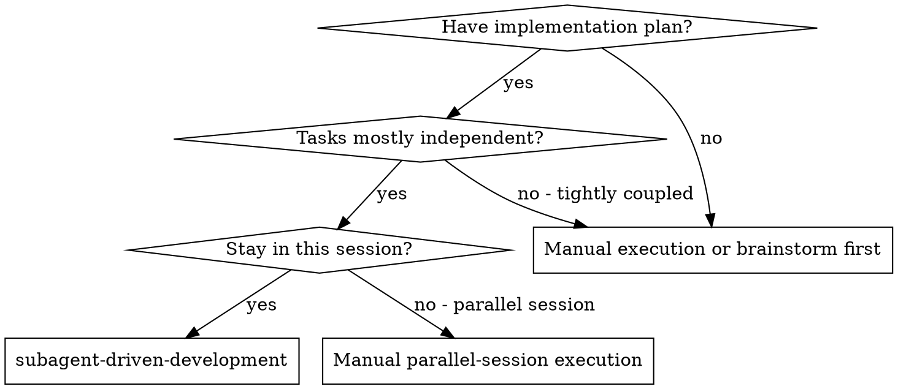
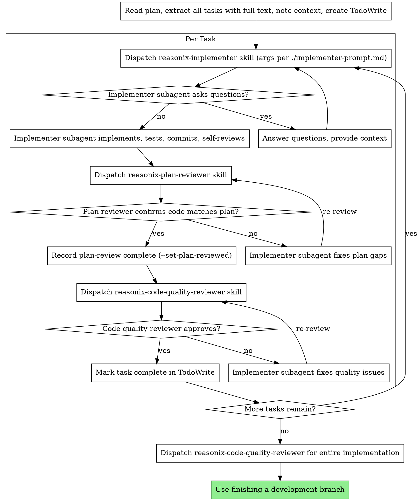

# Subagent-Driven Development (Reasonix)

> **Reasonix port.** Reviewers/implementer are dispatched as **`runAs: subagent` skills via `run_skill`** (Reasonix has no `subagent_type`/`Task`-agent mechanism). Writ's enforcement hooks do **not** fire here — review ordering is guaranteed **by construction** (this skill dispatches plan-review before quality-review), not by a gate. The `writ-mode-set` / `--set-plan-reviewed` bash below is a harmless no-op on Reasonix; left in so the same skill still works under Claude Code.

Execute plan by dispatching a fresh subagent skill per task, with two-stage review after each: plan compliance review first, then code quality review.

**Why subagents:** You delegate tasks to specialized agents with isolated context. By precisely crafting their instructions and context, you ensure they stay focused and succeed at their task. They should never inherit your session's context or history — you construct exactly what they need. This also preserves your own context for coordination work.

**Core principle:** Fresh subagent per task + two-stage review (plan then quality) = high quality, fast iteration

**Continuous execution:** Do not pause to check in with your human partner between tasks. Execute all tasks from the plan without stopping. The only reasons to stop are: BLOCKED status you cannot resolve, ambiguity that genuinely prevents progress, or all tasks complete. "Should I continue?" prompts and progress summaries waste their time — they asked you to execute the plan, so execute it.

## Step 0 — Set Writ mode (silent; no-op outside a Writ repo)

This skill executes an implementation plan (production code via subagents), so arm Writ Work mode before dispatching:

```bash
WR="${CLAUDE_PLUGIN_ROOT:-$(cat "${CLAUDE_PLUGIN_DATA:-$HOME/.cache/writ}/plugin-root" 2>/dev/null)}"; [ -x "$WR/bin/writ-mode-set.sh" ] && bash "$WR/bin/writ-mode-set.sh" work 2>/dev/null || true
```

## When to Use



**vs. Executing Plans (parallel session):**
- Same session (no context switch)
- Fresh subagent per task (no context pollution)
- Two-stage review after each task: plan compliance first, then code quality
- Faster iteration (no human-in-loop between tasks)

## The Process



> **Two-stage review = the reasonix reviewer subagent skills** (single source of truth, shared with `/reasonix-review-implementation`). Dispatch each via `run_skill` with the bare skill name + an `arguments` string carrying everything the reviewer needs (it has no other context). Use `continue_from` (the `sa_...` ref from the prior result's "Subagent reference: ..." line) for re-review loops:
> 1. **`reasonix-plan-reviewer`** — `run_skill({ name: "reasonix-plan-reviewer", arguments: "repo: <abs path from `pwd`>\nPlan: <path-or-full-text>\nbase_sha: <X>\nhead_sha: <Y>" })`. The subagent has no cwd context — always include the absolute `repo:` path. Returns `{status, issues[]}`. If `issues`, the implementer fixes and you re-dispatch (`continue_from` the prior reviewer run) until `compliant`.
> 2. **Record completion (Claude Code only).** On Reasonix the `writ-sdd-review-order` gate does not fire, so this is a no-op; ordering holds because this skill dispatches plan-review before quality-review. Left in for Claude Code parity:
>    ```bash
>    WR="${CLAUDE_PLUGIN_ROOT:-$(cat "${CLAUDE_PLUGIN_DATA:-$HOME/.cache/writ}/plugin-root" 2>/dev/null)}"; source "$WR/bin/lib/common.sh" 2>/dev/null && SID=$(cat "$WRIT_CURRENT_SESSION_FILE" 2>/dev/null); [ -n "$SID" ] && python3 "$WR/bin/lib/writ-session.py" update "$SID" --set-plan-reviewed default 2>/dev/null || true
>    ```
> 3. **`reasonix-code-quality-reviewer`** — `run_skill({ name: "reasonix-code-quality-reviewer", arguments: "repo: <abs path from `pwd`>\nbase_sha: <X>\nhead_sha: <Y>" })`. Returns `{status, critical/important/minor}`.

## Model Selection

### `best-subagent` mode

When the user invokes this skill with `best-subagent` (e.g. "run subagent-driven-development in best-subagent mode"), all implementing subagents — including regression-fix dispatches — run on the most capable available model at max thinking and max effort. Reviewer subagents remain at standard effort. This mode trades cost for maximum correctness; use when the user has explicitly granted permission.

### Default mode

Use the least powerful model that can handle each role to conserve cost and increase speed.

**Mechanical implementation tasks** (isolated functions, clear specs, 1-2 files): use a fast, cheap model. Most implementation tasks are mechanical when the plan is well-specified.

**Integration and judgment tasks** (multi-file coordination, pattern matching, debugging): use a standard model.

**Architecture, design, and review tasks**: use the most capable available model.

**Task complexity signals:**
- Touches 1-2 files with a complete spec → cheap model
- Touches multiple files with integration concerns → standard model
- Requires design judgment or broad codebase understanding → most capable model
## Regression Handling Protocol

After each task's implementation is complete and tests run, check for regressions (pre-existing tests that now fail).

**If regression found:**

1. **Attempt 1** — dispatch fix subagent (max thinking + effort) with the failing test names, the implementation diff, and instructions to fix the production code (not the tests).
2. **Attempt 2** — if regression persists after attempt 1, dispatch a second fix subagent. Same constraints.
3. **After 2 failed fix attempts** — stop fixing. Reflect: what did the implementation break and why could it not be fixed cleanly? Document the root cause in a short internal note.
4. **Revert the implementation** for this task (git revert or reset to pre-task commit on the worktree branch).
5. **Retry the implementation once** — dispatch a fresh implementing subagent with the original task text PLUS the root-cause reflection as additional context.
6. **If retry also causes regression that survives 2 fix attempts** — stop the entire process, revert the retry, and raise to the user with: the task that failed, the regression details, and the reflection notes.

**Test fixing prohibition:**

You and all subagents are **prohibited** from modifying existing tests to make them pass. The only exception: the new implementation intentionally changes a public interface or function signature, and the test update directly reflects that interface change (not masking a correctness bug). When applying the exception, the subagent must explicitly state which interface changed and why the test update is mechanical, not a workaround.

## Handling Implementer Status

Implementer subagents report one of four statuses. Handle each appropriately:

**DONE:** Proceed to plan compliance review.

**DONE_WITH_CONCERNS:** The implementer completed the work but flagged doubts. Read the concerns before proceeding. If the concerns are about correctness or scope, address them before review. If they're observations (e.g., "this file is getting large"), note them and proceed to review.

**NEEDS_CONTEXT:** The implementer needs information that wasn't provided. Provide the missing context and re-dispatch.

**BLOCKED:** The implementer cannot complete the task. Assess the blocker:
1. If it's a context problem, provide more context and re-dispatch with the same model
2. If the task requires more reasoning, re-dispatch with a more capable model
3. If the task is too large, break it into smaller pieces
4. If the plan itself is wrong, escalate to the human

**Never** ignore an escalation or force the same model to retry without changes. If the implementer said it's stuck, something needs to change.

## Dispatch (Reasonix run_skill)

- **Implementer** — `run_skill({ name: "reasonix-implementer", arguments: "repo: <abs path from \`pwd\`>\n<full task text + scene-setting context>" })`. Always include the absolute `repo:` path (the subagent has no cwd context). The implementer skill carries the persona; you supply the concrete task in `arguments` (do NOT make it read the plan file — paste what it needs). `./implementer-prompt.md` is kept as a checklist for what to put in `arguments`.
- **Reviewers** — dispatch the reasonix reviewer subagent skills via `run_skill`: `reasonix-plan-reviewer` then `reasonix-code-quality-reviewer`. Same skills `/reasonix-review-implementation` uses. See the two-stage review note above for the exact `arguments` and the `continue_from` re-review loop.

## Example Workflow

```
You: I'm using Subagent-Driven Development to execute this plan.

[Read plan file once: docs/superpowers/plans/feature-plan.md]
[Extract all 5 tasks with full text and context]
[Create TodoWrite with all tasks]

Task 1: Hook installation script

[Get Task 1 text and context (already extracted)]
[Dispatch implementation subagent with full task text + context]

Implementer: "Before I begin - should the hook be installed at user or system level?"

You: "User level (~/.config/superpowers/hooks/)"

Implementer: "Got it. Implementing now..."
[Later] Implementer:
  - Implemented install-hook command
  - Added tests, 5/5 passing
  - Self-review: Found I missed --force flag, added it
  - Committed

[Dispatch plan compliance reviewer]
Plan reviewer: ✅ Plan compliant - all requirements met, nothing extra

[Get git SHAs, dispatch code quality reviewer]
Code reviewer: Strengths: Good test coverage, clean. Issues: None. Approved.

[Mark Task 1 complete]

Task 2: Recovery modes

[Get Task 2 text and context (already extracted)]
[Dispatch implementation subagent with full task text + context]

Implementer: [No questions, proceeds]
Implementer:
  - Added verify/repair modes
  - 8/8 tests passing
  - Self-review: All good
  - Committed

[Dispatch plan compliance reviewer]
Plan reviewer: ❌ Issues:
  - Missing: Progress reporting (plan says "report every 100 items")
  - Extra: Added --json flag (not requested)

[Implementer fixes issues]
Implementer: Removed --json flag, added progress reporting

[Plan reviewer reviews again]
Plan reviewer: ✅ Plan compliant now

[Dispatch code quality reviewer]
Code reviewer: Strengths: Solid. Issues (Important): Magic number (100)

[Implementer fixes]
Implementer: Extracted PROGRESS_INTERVAL constant

[Code reviewer reviews again]
Code reviewer: ✅ Approved

[Mark Task 2 complete]

...

[After all tasks]
[Dispatch final code-reviewer]
Final reviewer: All requirements met, ready to merge

Done!
```

## Advantages

**vs. Manual execution:**
- Subagents follow TDD naturally
- Fresh context per task (no confusion)
- Parallel-safe (subagents don't interfere)
- Subagent can ask questions (before AND during work)

**vs. Executing Plans:**
- Same session (no handoff)
- Continuous progress (no waiting)
- Review checkpoints automatic

**Efficiency gains:**
- No file reading overhead (controller provides full text)
- Controller curates exactly what context is needed
- Subagent gets complete information upfront
- Questions surfaced before work begins (not after)

**Quality gates:**
- Self-review catches issues before handoff
- Two-stage review: plan compliance, then code quality
- Review loops ensure fixes actually work
- Plan compliance prevents over/under-building
- Code quality ensures implementation is well-built

**Cost:**
- More subagent invocations (implementer + 2 reviewers per task)
- Controller does more prep work (extracting all tasks upfront)
- Review loops add iterations
- But catches issues early (cheaper than debugging later)

## Red Flags

**Never:**
- Start implementation on main/master branch without explicit user consent
- Skip reviews (plan compliance OR code quality)
- Proceed with unfixed issues
- Dispatch multiple implementation subagents in parallel (conflicts)
- Make subagent read plan file (provide full text instead)
- Skip scene-setting context (subagent needs to understand where task fits)
- Ignore subagent questions (answer before letting them proceed)
- Accept "close enough" on plan compliance (plan reviewer found issues = not done)
- Skip review loops (reviewer found issues = implementer fixes = review again)
- Let implementer self-review replace actual review (both are needed)
- **Start code quality review before plan compliance is ✅** (wrong order)
- Move to next task while either review has open issues
- Allow any subagent to write files outside the worktree
- Instruct implementing subagents to follow TDD steps manually instead of invoking `/reasonix-tdd-implement`
- Fix tests to make them pass (see Regression Handling Protocol for the sole exception)
- Exceed 2 fix attempts on a regression without reflecting and reverting

**If subagent asks questions:**
- Answer clearly and completely
- Provide additional context if needed
- Don't rush them into implementation

**If reviewer finds issues:**
- Implementer (same subagent) fixes them
- Reviewer reviews again
- Repeat until approved
- Don't skip the re-review

**If subagent fails task:**
- Dispatch fix subagent with specific instructions
- Don't try to fix manually (context pollution)

## Integration

**Required workflow skills:**
- **using-git-worktrees** - **Mandatory.** Always create a new worktree before any implementation begins. All subagents must operate exclusively within that worktree. Monitor each subagent to confirm no files are written outside the worktree boundary.
- **writing-plans** - Creates the plan this skill executes
- **reasonix-review-implementation** - Two-stage review orchestrator (plan-compliance then code-quality); shares the same `reasonix-plan-reviewer` / `reasonix-code-quality-reviewer` subagent skills this skill dispatches
- **finishing-a-development-branch** - Complete development after all tasks; includes merge to main

**Implementing subagents MUST invoke the `/reasonix-tdd-implement` skill** — not manually replicate TDD steps, not construct a custom prompt with RED/GREEN/VERIFY instructions. The subagent must call the skill itself. Manually writing TDD-style steps in the prompt is not equivalent and is a violation. This applies to all implementing agents including regression-fix dispatches.

**After final review passes:** merge the worktree branch to main and clean up the worktree.

**Alternative workflow:**
- Manual parallel-session execution — use when tasks are tightly coupled or you prefer a separate session
