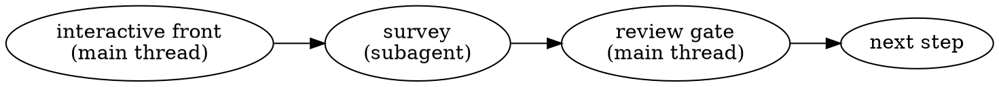

# Build Pipeline (orchestrator)

## Overview

Conducts the four-step feature workflow — **design → spec → research → plan** — while keeping the main session lean. Every heavy code survey is quarantined in a fresh-context `Agent` subagent; the main thread holds only the small markdown artifacts and one-page summaries. Interactive human gates run in the main thread.

**This skill does NOT write code, and does NOT merge the four skills.** Each step is still run by its own skill (`codebase-design-analysis`, `writing-detailed-specs`, `research`, `plan-from-specs`), which remain the single source of truth. The orchestrator dispatches a subagent that *reads that skill by path and follows it*. You can still invoke any of the four skills directly — this skill is an optional conductor on top.

**Core principle:** The main thread never opens source files to survey them. If you are reading code in the main thread, you are doing it wrong — dispatch a subagent.

---

## Non-negotiable rules (these counter known failure modes)

**Violating the letter of these rules is violating the spirit of them.**

1. **Isolate every heavy read. Never trust compaction.** Each step's code survey runs in a subagent with its own context window. The main thread must not fill — if it is filling, you skipped a dispatch. "Push through and let compaction keep the load-bearing facts" is forbidden. If the main thread fills from *legitimate* interactive fronts (interviews, review gates), the recovery is still NOT compaction: summarize each gate's outcome to a few lines as you go; if it still fills, write a short handoff and resume in a fresh session — the artifacts on disk are the real state, so that is safe. Never carry raw code across sessions.

2. **Verify at the depth the claim requires.** A claim about a *signature* may be checked by a targeted read; a claim about *behavior* requires reading the behavior. A grep that shows a return type does NOT verify what a function does. Seniority of the spec author is not evidence. **When unsure which kind of claim it is, treat it as behavior.** A return-type or contract claim ("returns a Result") is a behavior claim — read the body to confirm the function never raises or returns something else instead. "It's just a signature" is the lazy operator's self-justification; default to reading the body.

3. **Research trusts code, not the spec.** The research subagent verifies every assumption against the ACTUAL code. It must never accept the spec's claims or line numbers because they "look precise" or are labelled "pre-validated." This asymmetry is the whole point of the verification boundary.

4. **An invalidated assumption is a HARD STOP on the march to plan.** If research finds the spec's assumption is false, you do NOT proceed to plan. "I flagged it loudly and wrote the plan anyway" is forbidden, even under ship-tomorrow pressure. But hard-stop means *enter the Research loop-back* (below) — bounded auto-rewrite for mechanical/type-b invalidations, escalate to the user for type-c — not abandon the run. Never write the plan over an unresolved contradiction. **Narrow exception:** if the corrected fact provably changes NO build step, correct it in place and continue — but the bar is high. If you cannot show every build step is unaffected, it routes through the loop-back. "Probably fine" is not "provably unaffected."

5. **Directionality of trust.** Each step trusts the *verified* artifact directly upstream of it. Research is the verification boundary: everything downstream of research (the plan) may trust the research doc; everything at or upstream of research must be re-verified against code, never taken on the previous doc's word.

6. **Non-coder default (applies to every artifact).** The reader is a non-technical manager who cannot read code. This is the permanent default, not a per-invocation flag. Every section leads with a plain-English sentence of what it means and why it matters; code references (`file:line`, symbol names) go in parentheses or sub-bullets. The artifact must make sense if every `code`-formatted token were deleted. The skills enforce this via their reader-mode defaults. An `engineer-mode` opt-in flag exists for developers who want dense output — propagate it in the dispatch prompt when requested, otherwise omit (non-coder is assumed).

7. **Verify the artifact on disk after every subagent return.** A dispatched subagent can end its turn on intent-narration — "Now writing the full plan", "Let me write the complete plan" — WITHOUT ever emitting the Write tool call, so the artifact file is never created and the result message reads as if the write is about to happen. This is a known failure mode, not a pending action. After every dispatch, before trusting the summary, verify the artifact exists on disk (`ls -la <path>` + a line/byte count). A missing or empty file means the run failed regardless of what the summary text claims — re-dispatch with the write-discipline guard (see Dispatch prompt templates), or, once the subagent's reads are done, write the artifact in the main thread (isolation buys nothing for the emit step). Do not re-dispatch more than twice on the same narration failure — after two failed Writes, write it in the main thread.

---

## Setup prerequisite

Subagent model is **environment configuration, not a dispatch parameter** — the per-call `model` override does not change it. Before running, confirm the harness's subagent model is set to a capable Claude model. If a spawn fails resolving an unavailable model, fix the setting; do not retry blindly.

---

## Code exploration — CodeGraph first (mandatory when the repo is indexed)

When the repo has a `.codegraph/` directory, CodeGraph is the PRIMARY tool for locating and reading code — not Read, Grep, Glob, or bash. This applies to the **orchestrator** while grilling or reading context, AND to **every subagent** it dispatches. It is mandatory, not optional.

- **Start every code question with `codegraph_explore "<symbols or question>"`** — one call returns the verbatim source plus the call graph. Use `codegraph_node` for one symbol's full body, `codegraph_callers` for blast radius. If the tools are deferred, load them first via ToolSearch: `select:mcp__codegraph__codegraph_explore,mcp__codegraph__codegraph_node,mcp__codegraph__codegraph_callers`.
- **Use grep / bash / Read ONLY to view raw code AFTER CodeGraph has located it**, for non-code files (shell, yaml, config, markdown), or when there is no `.codegraph/` index.
- **Anti-pattern:** opening with `grep -r` / `find` / Read for a code-symbol lookup — it repeats work CodeGraph already pre-computed and costs far more tokens.

---

## Phase -1 — Requirement Interview (ALWAYS runs first)

**Before classifying tier, invoke the `/grill` skill.** Things that seem tiny might be jammed with landmines — the grill surfaces them. Grill is multi-turn and runs in the main thread.

**IMPORTANT: Do NOT conduct the interview yourself. Invoke `/grill` via the Skill tool. This is non-negotiable.**

**Recommendation scope guard:** The grill "recommended answer" answers the decision question only — e.g., "yes, surface it" or "no, keep it silent." It does NOT propose field names, data structures, storage formats, or code patterns. Any implementation idea that surfaces during the interview is a design input to capture, not a decision to lock. Lock the WHAT, not the HOW.

Pass the feature context as grill args. Update `CONTEXT.md` inline with any domain terms resolved during the grill.

**Urgency does not change this.** If the user says "this is urgent" or "can we just do it quick" — the interview still runs all 7 steps. A 15-minute interview that catches a landmine is cheaper than a plan built on wrong assumptions. Acknowledge the urgency, then proceed with the interview.

**Do not pre-classify.** If you find yourself thinking "I already know this is tiny/medium/heavy" before the interview is signed off — that is the interview rubber-stamping a pre-made conclusion, not generating evidence. The tier decision comes FROM the interview, not before it.

**Only after the interview is signed off, proceed to tier classification.**

---

## Scope-tier gate (runs AFTER Phase -1 interview)

Classify the change based on what the interview revealed. This decides which steps run.

| Tier | Test | Steps to run |
|------|------|--------------|
| **tiny** | 1–2 files, reversible, no new interface, no new public contract, no cross-module coupling surfaced in interview | orchestrator writes **mini-spec + success criteria** → **plan** (plan reads code, can escalate to medium) |
| **medium** | One phase, no cross-module contract change, no irreversible/auth/migration/infra impact | **design-lite → spec → research → plan** (precision code read in design, lighter implications, full options grid + success criteria) |
| **heavy** | Risky, irreversible, multi-phase, or touches auth/payments/migrations/secrets/infra/CI | **design → spec → research → plan** (full chain, full code read) |

State the tier, the evidence from the interview that determined it, and the steps you will run. Then proceed.

### Tiny-tier orchestrator duties (before dispatching plan)

For tiny tier, the orchestrator does two things before dispatching the plan subagent:

**1. Write mini-spec** from interview output. Structure:

```markdown
# Mini-Spec: <Feature>
_From grill interview, <date>_

## Requirement (restated)
[Restated requirement from interview sign-off]

## Scope
- In: [what's in scope]
- Out: [what's explicitly out]

## Done when
[Success criteria from interview]

## Edge cases discussed
[From interview step 4]
```

Write to `docs/AI_artifacts/2_specs/$FEATURE-mini.md`.

**2. Write success criteria** to `behavior_inventory.yaml`. Convert interview done-when answers into inventory entries with `origin: design`, `granularity: outcome`. Use the ID prefix from interview step 7. These are design-intent entries — implementation cannot override them (see update-behavior-guide conflict rules).

---

## The loop

For each step in the chosen set, in order:



1. **Interactive front (main thread).** Run only the parts of the step that need the human or are inherently multi-turn — see the per-step table. Lock those decisions.
2. **Dispatch the survey (subagent).** Use the matching dispatch template below. The subagent reads the skill by path, does the heavy reading, writes the artifact to its destination folder, and returns a ≤1-page summary. It defers any question it hits into the artifact instead of asking.
3. **Review gate (main thread).** Read the subagent's *summary* (not the artifact's code). Surface any deferred questions to the human via `AskUserQuestion`. If the human changes a decision, re-dispatch to finalize. Apply rule 4: if research returned invalidated assumptions, STOP.
4. **Phase transition gate (main thread).** Before dispatching the next phase's subagent, output a brief message to the user:
   - Which phase just completed and what artifact was written (path)
   - Which phase is next and what it will do in one sentence
   - A reminder: "Context window note: all artifacts are on disk. If your session context is running low, this is a safe breakpoint to continue in a fresh chat."
   - Ask: "Ready to proceed to [next phase], or would you like to pause here?"
   Wait for explicit user confirmation before dispatching the next subagent. This is a hard gate — do not auto-proceed.
   - **Writ mode (silent; no-op outside a Writ repo):** if the next phase is `plan`, arm Writ Work mode first so downstream implementation runs under Writ's plan→test→code gate machine. (That machine gates *code writes* on human approval via `/writ-approve`; it does NOT read a file named plan.md — our plan lives at `docs/AI_artifacts/4_plans/<slug>.md` and must carry the `## Files`/`## Rules Applied`/`## Capabilities` gate sections.):
     ```bash
     WR="${CLAUDE_PLUGIN_ROOT:-$(cat "${CLAUDE_PLUGIN_DATA:-$HOME/.cache/writ}/plugin-root" 2>/dev/null)}"; [ -x "$WR/bin/writ-mode-set.sh" ] && bash "$WR/bin/writ-mode-set.sh" work 2>/dev/null || true
     ```

## Guardrails integration (D4-04 — no-op outside a Writ repo)

Project guardrails (constraints / tech-debt / open-questions / ADRs) thread through the pipeline. All commands no-op silently outside a Writ repo. Resolve the engine once at pipeline start:

```bash
WR="${CLAUDE_PLUGIN_ROOT:-$(cat "${CLAUDE_PLUGIN_DATA:-$HOME/.cache/writ}/plugin-root" 2>/dev/null)}"; PR="$WR/bin/writ-project-rules.sh"
```

**1. Phase-start TD/OQ scan (orchestrator, before the design dispatch).** TD/OQ are small flat docs — the orchestrator reads them directly (not code). Read `docs/TECH_DEBT.md` + `docs/OPEN_QUESTIONS.md`; surface any entry that bears on the current roadmap phase to the user ("TD-07 and OQ-03 look in-scope for this phase — fold them in?") and pass the relevant ones into the design dispatch prompt as inputs.

**2. Constraint preload (orchestrator, once; injected into EVERY dispatch).** Load the FULL project-constraint set verbatim — NOT a ranked query (a ranked query both misses far-but-relevant constraints and injects near-but-irrelevant ones):

```bash
[ -x "$PR" ] && bash "$PR" list || true
```

Empty output → no constraints, inject nothing (no forced minimum). Otherwise paste the set into each subagent dispatch prompt under `## Active project constraints` — the subagent judges relevance per constraint via its `Trigger`. This is the reliable path: RAG/subagent-start retrieval is ranked and can silently drop a constraint, so do NOT rely on it here.

**3. Discovery capture (workers report → orchestrator persists).** Subagents are isolated; they must NOT write guardrail docs or author rules themselves (concurrent-write + daemon-access mess). Instead:
- **Every dispatch prompt** ends with: *"If you discover a constraint, tech-debt item, open question, or architectural decision while working, do NOT write it anywhere — list it in a `## Discoveries` section of your return summary (type + one-line description + where you saw it)."*
- **At each review/phase gate** the orchestrator collects reported `## Discoveries` and persists them (confirm with the user first):
  - **Tech debt** → append a `TD-NN` card to `docs/TECH_DEBT.md` (`/guardrail-check`).
  - **Open question** → append an `OQ-NN` card to `docs/OPEN_QUESTIONS.md`.
  - **Constraint** → `bash "$PR" author …` (graph + `docs/rules/` export); remind user to commit `docs/rules/`.
  - **ADR** → write `docs/adr/NNNN-slug.md`; if it carries a durable enforceable consequence, offer the hybrid rule extract (`--source-attribution ADR-NNNN`).

### What runs where, per step

**Heavy tier:**

| Step | Skill | Interactive front (main thread) | Subagent survey |
|------|-------|--------------------------------|-----------------|
| design | `codebase-design-analysis` | (interview already done in Phase -1) — lock decisions from interview | Steps 0–6: full code read, implications, success criteria, viable options, write design doc |
| spec | `writing-detailed-specs` | none (confirm phase boundary if the subagent flags it) | whole skill: inventory + write spec |
| research | `research` | calibration-plan gate, if the subagent flags scope ambiguity | whole skill: deep-trace + verify assumptions |
| plan | `plan-from-specs` | annotation handling (only on revision runs) | whole skill: draft phases + confirm exact lines |

**Medium tier:**

| Step | Skill | Interactive front (main thread) | Subagent survey |
|------|-------|--------------------------------|-----------------|
| design-lite | `codebase-design-analysis` | (interview already done in Phase -1) — lock decisions from interview | Precision code read (direct functions + immediate callers/callees), lighter Step 3 (decision-relevant facts only), full Step 3.5 + options grid, write design doc |
| spec | `writing-detailed-specs` | none | whole skill: inventory + write spec |
| research | `research` | calibration-plan gate | whole skill: full deep-trace + verify assumptions |
| plan | `plan-from-specs` | none | whole skill: draft phases |

**Tiny tier:**

| Step | Skill | Interactive front (main thread) | Subagent survey |
|------|-------|--------------------------------|-----------------|
| (orchestrator) | — | Write mini-spec + success criteria from interview | — |
| plan | `plan-from-specs` (tiny mode) | none | Read code, draft phases. Can escalate to medium. |

---

## Research loop-back (resolving invalidated assumptions)

When a research dispatch returns invalidated assumptions, the orchestrator does NOT proceed to plan — but it also does not, by default, dump the whole problem back on the human. It drives a **bounded** resolution loop. Classify each invalidated assumption:

| Class | Test | Action |
|-------|------|--------|
| **Mechanical** | exactly ONE sensible resolution (wrong line number, "returns `Result` not `bool`", renamed symbol) | Auto-apply the corrected fact to the spec as a targeted patch. No user. |
| **Type-b (spec approach)** | the chosen design option still holds, AND it is NOT "big" (below) | Dispatch a targeted spec patch that rewrites ONLY the affected components + their assumption rows, using the orchestrator's own design judgment — **NEVER transcribing research's "suggested resolution" verbatim** (research findings are inputs, not decisions). Notify the user; do not gate. |
| **Type-c / big** | touches an existing public API / schema / cross-module contract, OR contradicts a STATE.md/ADR decision, OR cannot be resolved from code alone | **STOP. Escalate** to the user (see below). |

"Big" uses the **same** test as `plan-from-specs`' big-disagreement protocol — one boundary across the whole pipeline, not a second invented one.

**After any mechanical or type-b patch:** re-dispatch the SAME research step on the same file. Research auto-enters its **re-check mode** (it finds the existing `## Invalidated Assumptions` section) and re-verifies, marking each Resolved / Still-invalidated / New. Read those counts to decide the next move — do not re-derive the comparison yourself.

**Loop guards (non-negotiable):**
1. **Cap of 2 auto-rewrite cycles.** If the 3rd research pass still reports ANY invalidation, escalate to the user regardless of class. Non-convergence is itself the signal a human is needed.
2. **Regression = immediate escalation.** If a patch resolves the flagged assumption but the re-check reports a NEW invalidation, stop and escalate at once — do not spend the remaining budget. A patch that breaks something new means the orchestrator's judgment was wrong, which is exactly when the human must step in.
3. The loop proceeds autonomously ONLY while the invalidation set is **strictly shrinking**.

**Escalation (type-c, cap hit, or regression):** hand the user a structured brief — *what the spec claimed / what the code actually shows / why it matters / 2–3 resolution options* — via `AskUserQuestion`, never a vague "redesign needed."

**Never silently resume.** On the user's decision, re-enter the **design step** (run with the resolution locked — no new interview needed since Phase -1 is already done), then continue spec → research → plan. The re-run design doc states plainly what changed (original design vs adjusted design) so the reader sees what was changed and why.

**Why the orchestrator may patch a type-b spec but never a type-c:** a type-b fix stays inside the already-chosen design option and below the contract/decision line — it is execution detail the orchestrator can own. A type-c fix changes the chosen approach, which is a design decision and therefore the user's call (the human has final authority on design). The bias guard holds throughout: research verifies, the spec-rewriter (with design judgment) decides, and they are never the same voice transcribing itself.

## Plan completion gate — orchestrator verifies the returned plan (runs after the plan dispatch)

The plan subagent sees only its inputs (spec + research). The orchestrator has run the whole pipeline (interview → design → spec → research → plan) and is the ONLY voice that knows the full doc landscape AND what the downstream implementer orchestrator (e.g. `/deepseek-orchestrate`) actually consumes. Two orchestrator-owned duties fire here, in order, after the plan subagent returns and the file is verified on disk (rule 7):

### 1. Orchestrator writes `## Read first`

`## Read first` is the "open before writing code" pointer list — every doc a future implementer must read before touching code (spec, research, ADRs, frozen contracts, CLAUDE.md inline invariants, STATE.md, CONTEXT.md, OPEN_QUESTIONS.md, TECH_DEBT.md, grill notes, online_research). **The plan subagent cannot write this completely** — it only saw spec + research, not the design doc's ADRs, the interview's grill notes, the design's CONTEXT term updates, or the TD/OQ entries the orchestrator folded in at phase start. The orchestrator did see all of those. So the orchestrator writes `## Read first` in the main thread, prepended to the plan file, after the plan subagent returns. Do NOT ask the plan subagent to write it — its view is too narrow and it will miss docs it never opened.

The list is the union of: every artifact this pipeline produced (design, spec, research, any ADR), every frozen contract the decision touches (skeleton-contracts, prior ADRs), the inline invariants in CLAUDE.md that bear on this feature, the TD/OQ entries the phase-start scan folded in, and the online_research doc if research cited one. One bullet per doc, with the one-line reason it is load-bearing for THIS plan. End with the CodeGraph-first directive line (the repo is indexed → `codegraph_explore`/`codegraph_node`/`codegraph_callers` are the primary code-read tool, not grep/Read-first) — it applies to every plan.

### 2. Orchestrator checks the plan for full structure fulfillment

A plan missing a section the downstream implementer depends on is INCOMPLETE. In a past run the plan subagent omitted the **Parallel waves** block under `## Implementation Order`, the orchestrator did not catch it, and the implementer orchestrator (`/deepseek-orchestrate`, which hands off one wave at a time and treats each wave's file list as its authority boundary) could not run. Do not trust the subagent's summary that "the plan is complete." Open the plan file and verify EACH section the implementer consumes is present AND complete:

| Section | Present check | Completeness check |
|---------|---------------|--------------------|
| `## Read first` | orchestrator just wrote it (duty 1) | union of all pipeline docs + load-bearing reason per bullet + CodeGraph-first line |
| `## Files` | Create + Modify tables | every touched file named with its test file (basename-strict); no "etc." / "and friends" |
| `## Implementation Order` | dependency graph present | **MUST contain a "Parallel waves" sub-block**: tasks grouped into ordered waves (A, B, C…), each wave's tasks touch DISJOINT files (verified against ## Files), critical path named. A bare linear arrow chain with no waves block = INCOMPLETE — re-dispatch or append the waves block in the main thread. |
| `## Delegation Authority` | per-step owner-role table | each step's owner + cross-phase boundary notes (e.g. P3-owns-X / P5-consumes) if any |
| `## Rules Applied` | PROJ-* + inline invariants | every active constraint from the phase-start `writ-project-rules.sh list` that bears on this feature, with a "why it applies" one-liner |
| `## Capabilities` | unchecked `- [ ]` | every spec Component ID mapped to a Task; the Self-Review coverage table is the cross-check |
| `## Steps` | `### Task N` / `### Step N` with `- [ ]` | TDD test→fail→implement→run-pass→commit rhythm per step; no "Phases" misnamed as "Steps" |
| `## E2E Done Criteria` (medium/heavy) | present | a REAL live-stack walkthrough (start dev+worker → observed UI/logs/DB signals), mapped to ## Capabilities IDs — not a restatement of unit tests |
| `## Open Questions` + `## Out of Scope` | present | OQs resolved-or-flagged; scope fences explicit |

**If ANY section is missing or incomplete:** do NOT auto-proceed to the phase-transition gate. Either (a) re-dispatch the plan subagent with the exact gap named ("the ## Implementation Order block has no Parallel waves sub-block — add waves A/B/C with disjoint-file verification against ## Files"), or (b) if the gap is mechanical (a missing sub-block the orchestrator can derive from ## Files + the dependency graph, e.g. the waves block), append it in the main thread. Re-verify after the fix. Cap re-dispatches at 2 on the same gap; after that, fix it in the main thread.

**The Parallel-waves check is non-negotiable** because it is the contract `/deepseek-orchestrate` consumes: that skill hands off one wave at a time and uses each wave's file list as the authority boundary for its subagents. A waveless plan cannot be driven by it. This is why the orchestrator — not the plan subagent — must confirm the waves block exists and is disjoint-file-verified.

This gate replaces the generic "review gate" step 3 of the loop FOR THE PLAN PHASE ONLY — it is the plan-specific review gate.

---

## Destination folders (where each artifact lands)

| Artifact | Folder |
|----------|--------|
| draft (input) | `docs/AI_artifacts/0_draft/` |
| design doc | `docs/AI_artifacts/1_design/` |
| success criteria | `docs/AI_artifacts/1.5_usability_test/` |
| spec | `docs/AI_artifacts/2_specs/` |
| research doc | `docs/AI_artifacts/3_research/` |
| plan | `docs/AI_artifacts/4_plans/` |
| ADR | `docs/architecture/system_adr/` (system-wide) or the phase's `adr/` folder |
| STATE.md, CLAUDE.md, CONTEXT.md, OPEN_QUESTIONS.md, CONSTRAINTS.md, TECH_DEBT.md | repo root |

The skills know these paths, but **always restate the exact destination in the dispatch prompt** — a cold subagent should not have to guess.

---

## Cross-cutting outputs — do these DURING the run, at the step that owns them (not at the end)

| Output | When | How |
|--------|------|-----|
| **CONTEXT.md** (new/clarified terms) | Phase -1 interview + design step | update inline as terms are resolved |
| **CONSTRAINTS.md / TECH_DEBT.md** (new constraint or debt surfaced) | any step that surfaces one | call `/guardrail-check Write` to record it before the step finishes |
| **OPEN_QUESTIONS.md** (unresolved decisions) | design + plan steps | sync the artifact's "Open Questions" section into root `OPEN_QUESTIONS.md`; mark blockers |
| **ADR** (hard-to-reverse + surprising + real-tradeoff decision) | design step | the design skill offers it when all three gates pass — accept the offer and write it |
| **behavior_inventory.yaml** | design Step 3.5 (medium/heavy) or orchestrator (tiny) | entries with `origin: design`, `granularity: outcome` — implementation cannot override |

> **Diagrams temporarily disabled** — the draw-diagram skill is being reworked. The pipeline runs diagram-free for now: skills write plain-English architecture/overview prose instead of Q1–Q5 diagrams. Do not call `/draw-diagram` from any step.

If a step's subagent should produce one of these, say so explicitly in its dispatch prompt.

---

## End of pipeline — update the durable docs

After the plan is written (and only if no hard stop fired), update the project's source-of-truth docs so a fresh session starts accurate:

- Invoke the `update-project-docs` skill (session-end sweep) to update **STATE.md** and **CLAUDE.md** — current position, what was built/planned, open questions, tech debt.
- Confirm **OPEN_QUESTIONS.md** reflects any blockers the plan raised.

Do this once, at the end — not per step (per-step writes churn STATE.md mid-feature).

---

## Dispatch prompt templates

Fill the `<...>` slots. Always give **absolute** skill and artifact paths. Always end with "defer questions, do not ask; return a ≤1-page summary." Every dispatch MUST also tell the subagent: when `.codegraph/` exists, use CodeGraph (`codegraph_explore`/`codegraph_node`/`codegraph_callers`) as the primary explore tool — grep/bash/Read only to view raw code after a codegraph query, or for non-code files.

Every dispatch MUST also carry the **write-discipline guard** (subagents can end their turn narrating intent — "now writing" / "let me write" — without emitting the Write tool call, leaving the artifact unwritten; the result message then reads as if the write is pending). Instruct the subagent: (a) its first artifact-producing action MUST be a `Write` tool call to the destination path — not a Read, not a codegraph call, not a sentence describing intent; (b) the phrases "now writing", "let me write", "about to write", "I'll write the plan next" are forbidden — they indicate the Write was not emitted; (c) if a `Write` is denied by a hook (e.g. a Writ plan-gate), paste the exact denial text verbatim instead of silently moving on; (d) for large artifacts (plans ~40KB+), write incrementally — first `Write` the header + first sections, then `Edit`-append the rest — rather than emitting the whole file in one Write call.

### design (heavy tier — full code read, full implications)

```
NON-INTERACTIVE: true
Follow the skill at ~/.claude/skills/codebase-design-analysis/SKILL.md.
SKIP Phase -1 (the interview) — requirements are already locked: <paste locked requirements>.
Repo root: <abs path>. Read CLAUDE.md and the files it points to. Run guardrail-check.

FULL CODE READ — read all files listed plus their imports/dependencies.

Produce the options grid: present every viable option with full treatment. Rejected alternatives
get one-line dismissal with reason.

Write success criteria to behavior_inventory.yaml with origin: design, granularity: outcome.
Derive the ID prefix by reading existing entries in behavior_inventory.yaml and following the pattern. State the chosen prefix in the design doc header.
Write the design doc to "docs/AI_artifacts/1_design/<slug>.md".
The design doc MUST contain these ## sections (enforced by the validate-design-doc gate): ## Summary, ## Constraints, ## Alternatives Considered (name >=2), ## Chosen Approach, ## Risks (each with a mitigation), ## Open Questions. Each section except Open Questions >=50 words; no TODO/TBD/placeholder text.
Update CONTEXT.md for any new term.
If the decision is hard-to-reverse + surprising + a real trade-off, write an ADR to docs/architecture/system_adr/.
Non-coder readable is the default (plain English leads, code in sub-bullets, glossary table).
Defer any decision into the doc's "Open questions" — do NOT ask me. Return a ≤1-page summary + any deferred questions.
```

### design-lite (medium tier — precision code read, lighter implications)

```
NON-INTERACTIVE: true
Follow the skill at ~/.claude/skills/codebase-design-analysis/SKILL.md.
SKIP Phase -1 (the interview) — requirements are already locked: <paste locked requirements>.
Repo root: <abs path>. Read CLAUDE.md and the files it points to. Run guardrail-check.

PRECISION CODE READ — read only the functions/modules directly named in the requirement
+ their immediate callers/callees. Skip transitive dependencies — research traces those.

LIGHTER Step 3 (implications) — focus on decision-relevant facts only. Skip exhaustive
atomic enumeration of every indirect dependency. Enough to inform option selection, not
a full audit.

FULL STRENGTH Step 3.5 (success criteria) — write to behavior_inventory.yaml with
origin: design, granularity: outcome. No shortcuts. Derive the ID prefix from existing
entries in behavior_inventory.yaml and state the chosen prefix in the design doc header.

FULL STRENGTH Step 4 (options) — present every viable option with full treatment.

Write the design doc to "docs/AI_artifacts/1_design/<slug>.md".
The design doc MUST contain these ## sections (enforced by the validate-design-doc gate): ## Summary, ## Constraints, ## Alternatives Considered (name >=2), ## Chosen Approach, ## Risks (each with a mitigation), ## Open Questions. Each section except Open Questions >=50 words; no TODO/TBD/placeholder text.
Update CONTEXT.md for any new term.
Non-coder readable is the default.
Defer any decision into the doc's "Open questions" — do NOT ask me. Return a ≤1-page summary + any deferred questions.
```

### spec (medium + heavy tiers)

```
NON-INTERACTIVE: true
Follow the skill at ~/.claude/skills/writing-detailed-specs/SKILL.md.
Inputs: design doc at "docs/AI_artifacts/1_design/<slug>.md"; repo root <abs path> (read CLAUDE.md + referenced files).

Write the spec to "docs/AI_artifacts/2_specs/<slug>.md". Non-coder readable is the default.
Defer questions into the spec; do NOT ask me. Return a ≤1-page summary + deferred questions.
```

### research (independence is mandatory — this prompt is load-bearing)

```
NON-INTERACTIVE: true
Follow the skill at ~/.claude/skills/research/SKILL.md.
Verify the spec at "docs/AI_artifacts/2_specs/<slug>.md" against the ACTUAL code in repo root <abs path>.
Do NOT trust the spec's claims, line numbers, or any "pre-validated" label — open the real files and confirm
each assumption at the depth its claim requires (behavior claims need behavior reading, not a signature grep).

Write findings to "docs/AI_artifacts/3_research/<slug>.md", including the Spec Verification table
and Invalidated Assumptions section if any assumption is false. Non-coder readable.
Return a ≤1-page summary stating counts: validated / invalidated / unverifiable, and list any invalidated IDs.
```

### plan — standard mode (medium + heavy tiers)

```
NON-INTERACTIVE: true
Follow the skill at ~/.claude/skills/plan-from-specs/SKILL.md.
Mode: standard.
Inputs: spec "docs/AI_artifacts/2_specs/<slug>.md" + research "docs/AI_artifacts/3_research/<slug>.md" + repo root <abs path>.
FIRST check the research doc's "Invalidated Assumptions" — if non-empty, STOP and report; do not write a plan.

Reference spec component IDs; do NOT restate the spec.

Name implementation sub-units **Steps** (`## Steps`, `### Step N`) — never "Phases" (reserved for roadmap P0/P1/…); the action list inside a Step is `**Actions**:`. Follow the project CLAUDE.md Phase/Step convention if it has one.

Write the COMPLETE plan file in ONE Write call using plan-from-specs' Step 4 template: ## Analysis,
## Files, ## Delegation Authority, ## Rules Applied, ## Capabilities (unchecked `- [ ]`),
## Implementation Order, ## Steps, ## E2E Done Criteria, ## Open Questions, ## Out of Scope.
The ## Files / ## Rules Applied / ## Capabilities sections are REQUIRED by Writ's
plan-gate (_validate_phase_a) — omitting them blocks the downstream work gate. A partial file is INCOMPLETE.
Build ## Implementation Order (step dependency graph + parallel waves) and ## Delegation Authority
(allowed file set + off-limits coupling) FACTUALLY from codegraph — `codegraph_callers`/`codegraph_explore`
on each step's touched symbols — not from inference (the impact-analyzer hook auto-injects a caller
blast-radius when you Read the spec/plan). ## E2E Done Criteria = a real end-user/QC walkthrough on the
LIVE stack with observed signals (logs/DB/UI), mapped to the ## Capabilities IDs — not a restatement of unit tests.

Do NOT write a `## Read first` section — the orchestrator writes that after your return (it has the full
interview→design→spec→research doc landscape; you only see spec + research and will miss docs you never opened).
## Implementation Order MUST include a "Parallel waves" sub-block: tasks grouped into ordered waves (A, B, C…),
each wave's tasks touch DISJOINT files (verify against ## Files), critical path named. A bare linear dependency
chain with no waves block is INCOMPLETE — the downstream implementer orchestrator hands off one wave at a time
and uses each wave's file list as its authority boundary, so a waveless plan cannot be driven.

Write the plan to "docs/AI_artifacts/4_plans/<slug>.md". Non-coder readable is the default.
Do NOT run plan-from-specs Step 6 (the mid-session STATE.md write) — the orchestrator updates STATE.md once at pipeline end.
Return a ≤1-page summary + any open questions.
```

### plan — tiny mode

```
NON-INTERACTIVE: true
Follow the skill at ~/.claude/skills/plan-from-specs/SKILL.md.
Mode: tiny.
Inputs: mini-spec "docs/AI_artifacts/2_specs/<slug>-mini.md" + repo root <abs path>. No research doc — you read code directly.

TIER ESCALATION: If during code reading you discover complexity beyond tiny
scope (touches 3+ modules, crosses public API boundary, hits CONSTRAINTS.md constraint,
4+ integration points), HARD STOP. Report: "Classified as tiny but found [complexity]. Recommend
re-running as medium." Do NOT produce a plan over hidden complexity.

Name implementation sub-units **Steps** (`## Steps`, `### Step N`) — never "Phases"; the action list inside a Step is `**Actions**:`.

Write the COMPLETE plan file in ONE Write call using plan-from-specs' Step 4 template: ## Analysis,
## Files, ## Delegation Authority, ## Rules Applied, ## Capabilities (unchecked `- [ ]`),
## Implementation Order, ## Steps, ## Open Questions, ## Out of Scope. The ## Files / ## Rules Applied /
## Capabilities sections are REQUIRED by Writ's plan-gate. A partial file is INCOMPLETE.
(## E2E Done Criteria is OPTIONAL for tiny tier — a 1–2-file change rarely needs a full live walkthrough;
include it only if the change has an observable end-user effect. ## Implementation Order may be trivial for
a 1-step tiny plan — keep it but it can be one line — but if there is >1 task, still group them into waves
with disjoint-file verification; the implementer orchestrator consumes waves regardless of tier.)

Do NOT write a `## Read first` section — the orchestrator writes that after your return (even for tiny, it
owns the doc landscape: mini-spec + CLAUDE.md + any TD/OQ the phase-start scan folded in).

Write the plan to "docs/AI_artifacts/4_plans/<slug>.md". Non-coder readable is the default.
Do NOT run plan-from-specs Step 6.
Return a ≤1-page summary + any open questions + tier escalation if triggered.
```

---

## Red flags — STOP, you are rationalizing

| Thought | Reality |
|---------|---------|
| "I'll just read this one file in the main thread to check." | That is a survey. Dispatch a subagent. |
| "Context is filling but compaction will keep what matters." | Forbidden (rule 1). Isolate the read. |
| "A grep showing the return type is enough verification." | Only for a signature claim. Behavior claims need behavior reading (rule 2). |
| "The spec says it and the author is senior — accept it." | Research trusts code, not the spec (rule 3). |
| "Research found the spec is wrong but I'm 80% done — flag and proceed." | Hard stop to design (rule 4). |
| "I'll pass my research conclusions as truth to the plan." | Correct — but never generalize 'trust the doc' upstream of research (rule 5). |
| "I'll update STATE.md after each step." | End of pipeline only — per-step churns it. |
| "I'll dump the file:line stuff in the lead sentence." | Non-coder first — plain English leads, code in parentheses (rule 6). |
| "This looks tiny, skip the interview." | Interview ALWAYS runs first. Tiny things have hidden landmines. |
| "I'll conduct the Phase -1 interview myself instead of invoking /grill." | WRONG. Phase -1 MUST use `/grill` via Skill tool. Never substitute your own interview. |
| "I'll classify the tier before understanding the request." | Tier classification comes AFTER Phase -1 interview. Not before. |
| "I already know this is tiny — the interview won't change anything." | That's pre-classifying. The interview generates the evidence for the tier, not confirms your guess. |
| "User said it's urgent, I'll compress the interview." | Urgency doesn't change the protocol. All 7 steps. A 15-min interview beats a wrong plan. |
| "Steps 2 and 4 aren't needed for something this simple." | All 7 steps required. No compression. Term-sharpening and edge cases are WHERE landmines surface. |
| "The review gate went well, I'll just dispatch the next phase." | Phase transition gate is required. Output the transition message and wait for confirmation first. |
| "Tiny doesn't need success criteria in the inventory." | Every tier writes to behavior_inventory.yaml. Orchestrator does it for tiny. |
| "The subagent's summary says it wrote the plan, so I'll proceed." | Verify the file exists on disk first (rule 7). A subagent can narrate "now writing" and end its turn without calling Write — the summary then lies about completion. |
| "The plan subagent wrote `## Read first`, so it's covered." | No — the orchestrator writes `## Read first`. The subagent only saw spec+research; it missed the ADRs, grill notes, TD/OQ scan, online_research the orchestrator saw. Orchestrator owns this section. |
| "The plan has an `## Implementation Order` section, so it's complete." | Not enough — open it and confirm a "Parallel waves" sub-block exists (ordered waves, disjoint files, critical path). A bare linear chain with no waves is INCOMPLETE; `/deepseek-orchestrate` cannot drive a waveless plan. |
| "The plan subagent's summary says all sections are present." | Trust but verify — open the plan file and run the Plan completion gate table. The subagent has reported its own work complete while omitting waves before. |

---

## When a subagent result looks wrong

If a summary is internally inconsistent, the counts look off, or two artifacts conflict: you MAY read the *specific* artifact section needed to adjudicate — a narrow, deliberate exception to "read the summary, not the artifact." Do NOT re-survey source code in the main thread to settle it; re-dispatch the subagent with a correction instead. The ban on main-thread reading is about *surveying code*, not about checking a doc you already own.

## Common mistakes

- **Merging the skills into this one.** No — they stay separate and authoritative; this dispatches them.
- **Reading the subagent's full artifact in the main thread.** Read the summary. The artifact is the handoff for the *next* subagent, which reads it from disk.
- **Skipping the interview for seemingly simple requests.** Phase -1 always runs. Tier classification happens after.
- **Forgetting to restate the destination path in the dispatch prompt.** A cold subagent should never guess where to write.
- **Letting implementation-origin entries override design-origin entries in behavior_inventory.yaml.** Cross-origin conflicts get flagged, not auto-resolved. See update-behavior-guide conflict rules.
- **Not writing success criteria for tiny tier.** Orchestrator writes them to behavior_inventory.yaml before dispatching plan. Don't skip this.
- **Letting the plan subagent write `## Read first`.** Orchestrator owns it — it has the full pipeline doc landscape; the subagent has spec+research only. A subagent-written `## Read first` misses ADRs, grill notes, TD/OQ, online_research.
- **Skipping the Plan completion gate after the plan dispatch.** Open the plan file and verify every implementer-consumed section is present AND complete — especially the `## Implementation Order` "Parallel waves" sub-block. A waveless plan stalls `/deepseek-orchestrate`, which hands off one wave at a time.
